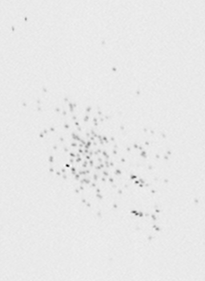

## UCSF NMR file format parser

<!-- Crates version -->
<a href="https://crates.io/crates/ucsf_nmr">
  
</a>
<!-- docs.rs docs -->
<a href="https://docs.rs/ucsf_nmr">
  
</a>

<br/>

This project provides a parser for the UCSF NMR file format written in Rust.

The implemenation follows the description of the format outlined at
<https://www.cgl.ucsf.edu/home/sparky/manual/files.html#UCSFFormat>.

## Installation

Via [cargo-edit](https://github.com/killercup/cargo-edit):

```
cargo add ucsf_nmr
```

## Usage examples

The example under [./examples/tile_plots.rs](./examples/tile_plots.rs) shows how to load a spectrum,
iterate over all the data points in it and draw a simple greyscale image from it with the help of [plotters](https://crates.io/crates/plotters):



#### License

<sup>
Licensed under either of <a href="LICENSE-APACHE">Apache License, Version
2.0</a> or <a href="LICENSE-MIT">MIT license</a> at your option.
</sup>

<br>

<sub>
Unless you explicitly state otherwise, any contribution intentionally submitted
for inclusion in this crate by you, as defined in the Apache-2.0 license, shall
be dual licensed as above, without any additional terms or conditions.
</sub>
